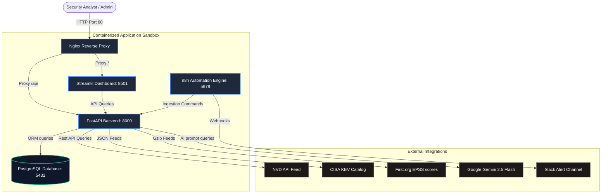
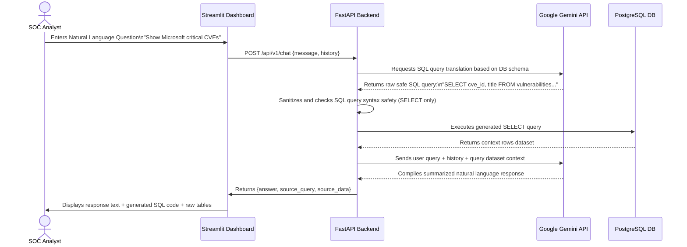
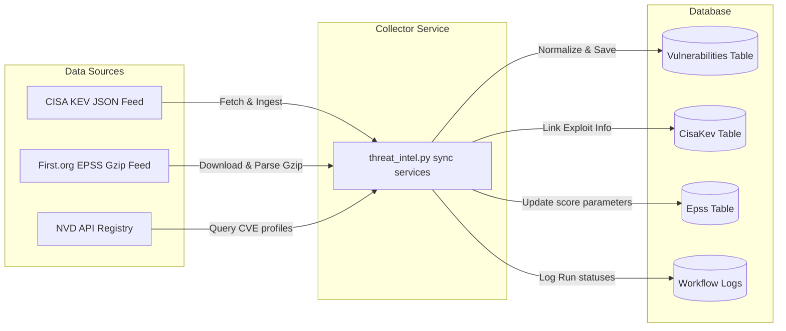
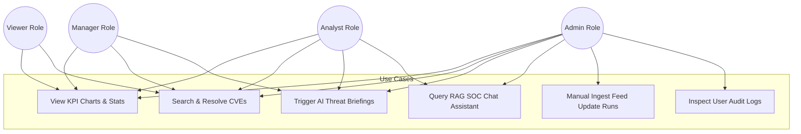

# System Architecture & Diagrams Documentation

This document compiles the Mermaid system diagrams mapping out the AI Cybersecurity Threat Intelligence & SOC Automation Platform.

---

## 1. System Architecture Diagram
Illustrates the container relationships, service layout, reverse proxy configurations, and external integrations.



---

## 2. Relational Entity Relationship (ER) Diagram
Maps out the normalized tables, structural schemas, data types, indexes, and primary/foreign keys.

```mermaid
erDiagram
    organizations {
        int id PK
        string name UNIQUE
        timestamp created_at
    }
    users {
        int id PK
        int organization_id FK
        string username UNIQUE
        string email UNIQUE
        string hashed_password
        string role
        boolean is_active
        timestamp created_at
    }
    vendors {
        int id PK
        string name UNIQUE
    }
    products {
        int id PK
        int vendor_id FK
        string name
    }
    vulnerabilities {
        string cve_id PK
        int organization_id FK
        string title
        string description
        numeric cvss_score
        string cvss_vector
        string severity
        int vendor_id FK
        int product_id FK
        timestamp published_date
    }
    cisa_kev {
        string cve_id PK_FK
        date date_added
        date due_date
        string action_required
        string short_description
    }
    epss {
        string cve_id PK_FK
        numeric score
        numeric percentile
        timestamp retrieved_at
    }
    ai_analysis {
        int id PK
        string cve_id FK_UNIQUE
        int organization_id FK
        string executive_summary
        string technical_analysis
        string risk_impact
        string recommendations
        string patch_priority
        int generated_by FK
    }
    workflow_logs {
        int id PK
        int organization_id FK
        string source
        string action_type
        string status
        string details
        timestamp created_at
    }
    audit_logs {
        int id PK
        int organization_id FK
        int user_id FK
        string action
        string resource
        string details
        string ip_address
        timestamp created_at
    }

    organizations ||--o{ users : "owns"
    organizations ||--o{ vulnerabilities : "contains"
    organizations ||--o{ ai_analysis : "contains"
    organizations ||--o{ workflow_logs : "records"
    organizations ||--o{ audit_logs : "contains"
    vendors ||--o{ products : "manufactures"
    vendors ||--o{ vulnerabilities : "discovers"
    products ||--o{ vulnerabilities : "contains"
    vulnerabilities ||--o| cisa_kev : "has_exploit"
    vulnerabilities ||--o| epss : "has_score"
    vulnerabilities ||--o| ai_analysis : "contains_ai_report"
    users ||--o{ ai_analysis : "generates"
    users ||--o{ audit_logs : "triggers"
```

---

## 3. Sequence Diagram (AI SOC Chat Inquiries)
Traces the operations of a user running a conversational SQL RAG assistant threat query.



---

## 4. Ingestion Data Flow Diagram
Maps out the data pipeline ingestion flows, from data source feeds to database storage.



---

## 5. Use Case Diagram
Describes the target user persona scopes and access rights.



---

## 6. Project Directory Structure

Below is the directory tree mapping the files and subfolders in this repository:

```text
├── backend/                            # FastAPI Backend Microservice
│   ├── Dockerfile                      # Backend container configuration
│   ├── requirements.txt                # Python backend dependencies
│   └── app/                            # Backend source code
│       ├── main.py                     # Entry point for backend ASGI application
│       ├── api/                        # REST API routes and dependency injection
│       │   ├── deps.py                 # Dependency utilities (Auth, DB session, Roles)
│       │   └── v1/                     # Version 1 API routers (Vulnerabilities, Chat, etc.)
│       ├── core/                       # Core setup (Settings, Security, JWT configs)
│       ├── database/                   # Database connection pooling & base classes
│       ├── models/                     # SQLAlchemy ORM schemas
│       ├── prompts/                    # String templates for Gemini prompts
│       ├── rag/                        # RAG Copilot core execution engines
│       ├── schemas/                    # Pydantic schemas (Data serialization & validation)
│       └── services/                   # Service integrations (threat enrichment, syncs, etc.)
│
├── dashboard/                          # Streamlit Analyst Web UI
│   ├── Dockerfile                      # Dashboard container configuration
│   ├── requirements.txt                # Streamlit dashboard dependencies
│   ├── app.py                          # Streamlit application entry point
│   ├── components/                     # Reusable UI widgets, CSS injection, auth helpers
│   │   ├── auth.py                     # Auth and token validation client
│   │   ├── charts.py                   # Plotly charts wrapper
│   │   └── ui.py                       # Premium glassmorphism custom CSS configurations
│   └── pages/                          # Multi-page views (Login, SOC Overview, Copilot, IR, etc.)
│
├── database/                           # Database Schema & Seed Data
│   ├── schema.sql                      # DDL definition of PostgreSQL database schema
│   ├── seed.sql                        # Multi-tenant DML seed scripts (users, products, orgs)
│   └── migration_v2.1_varchar_expand.sql # DB migration file
│
├── docs/                               # Architecture and PPT Assets
│   ├── architecture.md                 # System diagrams (Architecture, ER, Flow, Use Cases)
│   └── portfolio_assets.md             # STAR questions, resume bullet points, PPT scripts
│
├── n8n/                                # Automation Orchestrator Workflow Configuration
│   ├── credentials.example.md          # N8n endpoint setup instructions
│   └── workflows/                      # n8n workflows export files (CVE Alerts, SOC reporting)
│
├── tests/                              # Pytest test execution suites
│   ├── conftest.py                     # Mock database fixtures & testing overrides
│   ├── test_backend/                   # API boundary, RBAC role validation, and auth tests
│   └── test_database/                  # Data tier, foreign keys, and schema tests
│
├── .env.example                        # Template for configuring settings
├── docker-compose.yml                  # Multicontainer stack composition manifest
├── nginx.conf                          # Reverse proxy config mapping web traffic (Streamlit & FastAPI)
└── .gitignore                          # Exclude patterns for secrets, logs, cache, databases
```

---

## 7. Technology Stack & Core Integrations

### Web & Logic Backend Layer
- **FastAPI**: Async web framework powering the REST API. Handled through dependency injection routers to decouple schemas, DB calls, and business logic.
- **SQLAlchemy (ORM)**: Handles database persistence, querying, and relational bindings. Enforces strict row-level isolation filters based on current user context.
- **Pydantic v2**: Handles request payload parsing, strict types parsing, and model validation.

### Analyst Presentation & Visual Dashboard
- **Streamlit**: Python application web dashboard framework.
- **Glassmorphism UI Engine**: Injected CSS module creating a premium dark theme styling system (Inter fonts, translucent cards, and smooth hover micro-animations).
- **Plotly Express**: Renders interactive HTML charts (severity breakups, EPSS percentile histograms, etc.).

### Database & Storage Services
- **PostgreSQL 15 (Docker container)**: Persistent storage holding threat data, organization bindings, vulnerabilities, audit logs, and user schemas.
- **SQLite fallback**: Used locally or in tests to facilitate light operations without spawning PostgreSQL.

### AI & RAG Orchestration Layer
- **Google Gemini 2.5 Flash API**: Model powering NL2SQL conversion, automated incident playbooks, and copilot responses.
- **LangChain Core**: Powers the chat assistant via structured pipelines, prompt engineering, and `ConversationBufferMemory` which stores back-and-forth context histories.
- **Regex Guard Sanitizers**: Intercepts LLM-generated SQL statements to ensure no malicious operations (`DROP`, `DELETE`, `INSERT`) execute against the database.

### External Feeds (Data Sinks)
- **NVD API (National Vulnerability Database)**: Live CVE mappings.
- **CISA KEV (Known Exploited Vulnerabilities Catalog)**: Flags vulnerabilities with known active, real-world exploitation.
- **EPSS (Exploit Prediction Scoring System)**: Scores probability metrics of threat exploitability in the wild.
- **Reputational Feeds**: VirusTotal, AbuseIPDB, URLhaus, and AlienVault OTX lookups to assess files, hashes, domains, and IP reputations.

---

## 8. Core Workflows

### Multi-Tenant Isolation Flow
1. Analyst logs in. Token is generated containing `organization_id` and role permissions.
2. The user requests a dashboard overview or search query.
3. The backend interceptor `get_current_user` extracts the JWT, verifies parameters, and injects `current_user` context.
4. SQLAlchemy queries execute with an automatic filter override: `.filter(Vulnerability.organization_id == current_user.organization_id)`.
5. Data remains strictly separated, preventing tenants from inspecting cross-boundary assets.

### NL-to-SQL RAG Copilot Flow
1. User types: *"Show me critical vulnerabilities for Amazon"*.
2. Streamlit forwards query and context history to `/api/v1/chat`.
3. Gemini is prompted to write a SQL query based on database DDL schemas.
4. The backend checks the output against regex commands. If any keyword outside of `SELECT` is present, it blocks execution.
5. FastAPI runs the SQL query against PostgreSQL.
6. The query result is joined back to the conversation context and sent to Gemini to write an analyst-friendly response.

